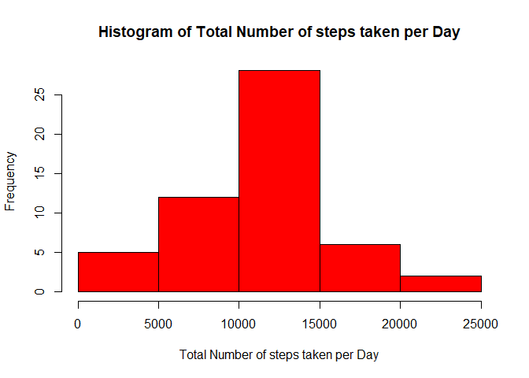
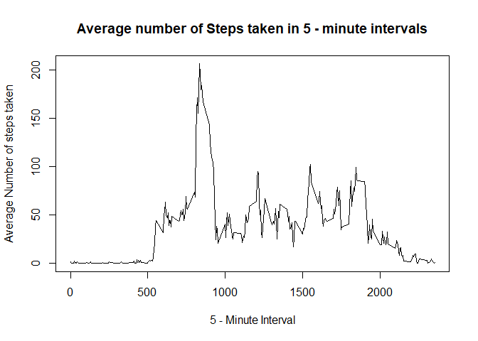
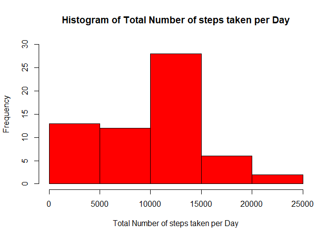
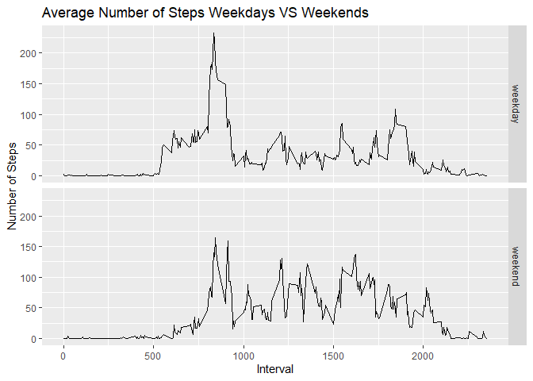

## Loading and preprocessing the data

In this stage of the process all the required library folders were loaded on to the package. Four packages in total are loaded in the program.


```r
library(lubridate)
```

```
## 
## Attaching package: 'lubridate'
```

```
## The following objects are masked from 'package:base':
## 
##     date, intersect, setdiff, union
```

```r
library(dplyr)
```

```
## 
## Attaching package: 'dplyr'
```

```
## The following objects are masked from 'package:lubridate':
## 
##     intersect, setdiff, union
```

```
## The following objects are masked from 'package:stats':
## 
##     filter, lag
```

```
## The following objects are masked from 'package:base':
## 
##     intersect, setdiff, setequal, union
```

```r
library(VIM)
```

```
## Loading required package: colorspace
```

```
## Loading required package: grid
```

```
## Loading required package: data.table
```

```
## 
## Attaching package: 'data.table'
```

```
## The following objects are masked from 'package:dplyr':
## 
##     between, first, last
```

```
## The following objects are masked from 'package:lubridate':
## 
##     hour, isoweek, mday, minute, month, quarter, second, wday, week,
##     yday, year
```

```
## VIM is ready to use. 
##  Since version 4.0.0 the GUI is in its own package VIMGUI.
## 
##           Please use the package to use the new (and old) GUI.
```

```
## Suggestions and bug-reports can be submitted at: https://github.com/alexkowa/VIM/issues
```

```
## 
## Attaching package: 'VIM'
```

```
## The following object is masked from 'package:datasets':
## 
##     sleep
```

```r
library(ggplot2)
```

After the packages are successfully loaded, the "activity.csv" file is then read into the program and the date column is changed from character to date format and the data-frame is converted into a tibble.


```r
activity = read.csv("activity.csv")
activity = activity %>% transform(date = as.Date(date))
activity = tbl_df(activity)
```


## What is mean total number of steps taken per day?

Now, as the data is read into the program a histogram is plotted that represents the total number of steps taken each day. In this stage of the process the missing values in the data set are ignored.

The plot below represents the histogram of total number of steps taken each day.


```r
activity1 = activity %>% group_by(date) %>% summarize(steps_sum = sum(steps))
hist(activity1$steps_sum, 
     col = 'red', xlab = "Total Number of steps taken per Day", 
     main = "Histogram of Total Number of steps taken per Day")
```

<!-- -->

Now after the histogram is plotted the mean and median number of steps taken each day is calculated.


```r
mean_steps = mean(activity1$steps_sum, na.rm = TRUE)
median_steps = median(activity1$steps_sum, na.rm = TRUE)
```

Hence, the mean number of steps taken each day is 1.0766189\times 10^{4} steps and the median number of steps takn each day is 10765 steps.

## What is the average daily activity pattern?

This is the stage where the daily activity pattern of the steps for each of the 5 - minute interval is found on an average level so as to understand a clear idea of how the considered subject's personal activity varies for different intervals of time on a daily basis.

So the below code is used to plot a time - series plot of the average number of steps taken in different intervals.


```r
activity2 = activity %>% group_by(interval) %>% summarize(Average_steps = mean(steps, na.rm = TRUE))
plot(activity2$interval, activity2$Average_steps, 
     type = "l", 
     xlab = "5 - Minute Interval", 
     ylab = "Average Number of steps taken", 
     main = "Average number of Steps taken in 5 - minute intervals")
```

<!-- -->

After this step based on the plot we find the 5 - minute interval that, on an average contains the maximum number of steps.


```r
max_interval = activity2$interval[which.max(activity2$Average_steps)]
```

Hence, the interval at which the maximum number of steps was taken on an average is 835.

## Imputing missing values

Now, since the missing values are ignored in the data set till this stage. In this stage, a strategy is implemented for imputing the missing values in the data set. For this purpose, the library **VIM** is loaded into the program. The function in this package kNN() is used for imputing the missing values in the data set.


```r
imputed_data = kNN(activity, variable = "steps")
```

Now after the missing values are imputed in the data set, with this new dataset a histogram is plotted that represents the total number of steps taken each day.


```r
impute_plot = imputed_data %>% group_by(date) %>% summarize(steps_sum = sum(steps))
hist(impute_plot$steps_sum, 
     col = 'red', xlab = "Total Number of steps taken per Day", 
     main = "Histogram of Total Number of steps taken per Day", ylim = c(0, 30))
```

<!-- -->

Then, to understand the change in the data set the mean and median number of steps taken each day is also calculate with this new data set.


```r
mean_steps_impute = mean(impute_plot$steps_sum)
median_steps_impute = median(impute_plot$steps_sum)
```

Hence, on recalculating, the mean and median number of steps taken each day are 9752.3934426 and 10395 steps respectively.

## Are there differences in activity patterns between weekdays and weekends?

This is the final stage of this project work. In this stage, again the time - series plot for understanding the average number of steps taken each day is plotted. But for this plot, the new imputed data set is taken into consideration and the plot is divided into 2 panels. One that contains the plot for all the weekdays and the other contains the plot for all the weekends. So this is done to understand the daily activity pattern acroos the weekdays and weekends.


```r
imputed_data$Day = weekdays(imputed_data$date)
imputed_data$WeekType = "weekday"
imputed_data$WeekType[imputed_data$Day %in% c("Saturday", "Sunday")] = "weekend"

grouped_dataset = imputed_data %>% group_by(WeekType, interval) %>% summarize(steps_sum = mean(steps))
qplot(interval, steps_sum, data = grouped_dataset, geom = "line", facets = WeekType~., xlab = "Interval", ylab = "Number of Steps", main = "Average Number of Steps Weekdays VS Weekends")
```

<!-- -->

So from the plot, it is clearly evident that there is considerable difference between the activity patterns between weekdays and the weekends.
